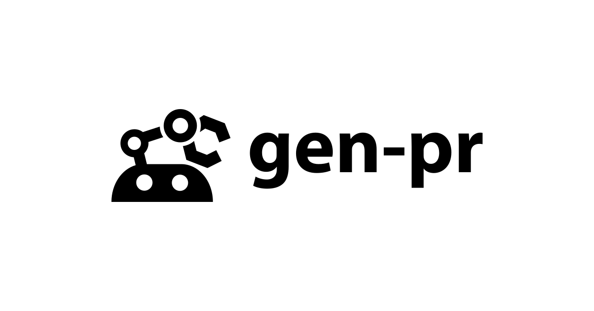

[](https://github.com/WillBooster/gen-pr/actions/workflows/test.yml)
[](https://github.com/semantic-release/semantic-release)

# gen-pr

A CLI and GitHub Action that automatically generate pull requests using AI (specifically, Large Language Models or LLMs).

This tool embodies the ultimate "Vibe Coding" experience, where humans can focus solely on writing issues while AI handles all the implementation details. Our vision is to create a workflow where developers only need to describe what they want, and the AI takes care of translating those requirements into working code.

## Features

- **Planning Capability**: Uses LLM to analyze source code and develop implementation strategies before making any changes
- **Multiple AI Coding Tools**: Supports various coding tools including:
  - [Aider](https://aider.chat/): An interactive AI pair programming tool
  - [Codex CLI](https://github.com/openai/codex): OpenAI's coding agent
  - [Claude Code](https://github.com/anthropics/claude-code): Anthropic's agentic coding tool
  - [Gemini CLI](https://github.com/google-gemini/gemini-cli): Google's AI coding assistant
- **Flexible Integration**: Works as both a CLI tool and a GitHub Action

## Requirements

- For development:
  - [asdf](https://asdf-vm.com/)
- For execution:
  - Node.js and npx (for `@openai/codex`, `@anthropic-ai/claude-code`, and `@google/gemini-cli`)
  - Python (for `aider`)
  - [gh](https://github.com/cli/cli)

## Usage

### GitHub Actions

See [action.yml](action.yml) and [.github/workflows/generate-pr-example.yml](.github/workflows/generate-pr-example.yml).

### CLI

Here are some examples for creating PRs for issue [#89](https://github.com/WillBooster/gen-pr/issues/89).

#### With Planning (Strongly Recommended for Aider)

`gen-pr` can generate an implementation plan by reading files in the target repository using [Repomix](https://github.com/yamadashy/repomix).
This feature is particularly useful for non-agentic coding tools like Aider.

Gemini 2.5 Pro (`gemini/gemini-2.5-pro`) for planning and Aider for coding:

```sh
npx --yes gen-pr --issue-number 89 --planning-model gemini/gemini-2.5-pro --reasoning-effort high --repomix-extra-args="--compress --remove-empty-lines --include 'src/**/*.ts'" --aider-extra-args="--model gemini/gemini-2.5-pro --edit-format diff-fenced --test-cmd='yarn check-for-ai' --auto-test"
```

Claude Opus 4 on Bedrock (`bedrock/us.anthropic.claude-opus-4-20250514-v1:0`) for planning and Aider for coding:

```sh
npx --yes gen-pr --issue-number 89 --planning-model bedrock/us.anthropic.claude-opus-4-20250514-v1:0 --reasoning-effort high --repomix-extra-args="--compress --remove-empty-lines --include 'src/**/*.ts'" --aider-extra-args="--model bedrock/us.anthropic.claude-opus-4-20250514-v1:0 --test-cmd='yarn check-for-ai' --auto-test"
```

Gemini 2.5 Pro (`gemini/gemini-2.5-pro`) for planning and Claude Code for coding:

```sh
npx --yes gen-pr --issue-number 89 --planning-model gemini/gemini-2.5-pro --reasoning-effort high --repomix-extra-args="--compress --remove-empty-lines --include 'src/**/*.ts'" --coding-tool claude-code
```

o4-mini (`openai/o4-mini`) for planning and Codex for coding:

```sh
npx --yes gen-pr --issue-number 89 --planning-model openai/o4-mini --reasoning-effort high --repomix-extra-args="--compress --remove-empty-lines --include 'src/**/*.ts'" --coding-tool codex
```

DeepSeek R1 on OpenRouter (`openrouter/deepseek/deepseek-r1-0528:free`) for planning and Gemini CLI for coding:

```sh
npx --yes gen-pr --issue-number 89 --planning-model openrouter/deepseek/deepseek-r1-0528:free --reasoning-effort high --repomix-extra-args="--compress --remove-empty-lines --include 'src/**/*.ts'" --coding-tool gemini
```

Local Gemma 3n via Ollama (`ollama/gemma3n`) for planning and Aider for coding:

```sh
npx --yes gen-pr --issue-number 89 --planning-model ollama/gemma3n --repomix-extra-args="--compress --remove-empty-lines --include 'src/**/*.ts'" --aider-extra-args="--model ollama/gemma3n --edit-format diff-fenced --test-cmd='yarn check-for-ai' --auto-test"
```

#### Without Planning

Claude Code:

```sh
npx --yes gen-pr --issue-number 89 --coding-tool claude-code
```

Codex:

```sh
npx --yes gen-pr --issue-number 89 --coding-tool codex
```

Gemini CLI:

```sh
npx --yes gen-pr --issue-number 89 --coding-tool gemini
```

#### For PR ([#103](https://github.com/WillBooster/gen-pr/pull/103))

Codex:

```sh
npx --yes gen-pr --issue-number 103 --coding-tool codex
```

### Supported Model Format

The tool requires **model names defined on [llmlite](https://docs.litellm.ai/docs/providers)** in the format `provider/model-name`:

- **OpenAI**: `openai/gpt-4.1`, `openai/o4-mini` and more
- **Azure OpenAI**: `azure/gpt-4.1`, `azure/o4-mini` and more
- **Google Gemini**: `gemini/gemini-2.5-pro`, `gemini/gemini-2.5-flash` and more
- **Anthropic**: `anthropic/claude-4-sonnet-latest`, `anthropic/claude-3-5-haiku-latest` and more
- **AWS Bedrock**: `bedrock/us.anthropic.claude-sonnet-4-20250514-v1:0`, `bedrock/us.anthropic.claude-3-5-haiku-20241022-v1:0` and more
- **Google Vertex AI**: `vertex/gemini-2.5-pro`, `vertex/gemini-2.5-flash` and more
- **OpenRouter**: `openrouter/deepseek/deepseek-r1-0528:free`, `openrouter/deepseek/deepseek-chat-v3-0324:free` and more
- **Ollama**: `ollama/gemma3n`, `ollama/deepseek-r1`, `ollama/qwen3` and more

### Environment Variables

Each provider uses standard environment variables for authentication:

- Planning Models
  - **OpenAI**: `OPENAI_API_KEY`
  - **Anthropic**: `ANTHROPIC_API_KEY`
  - **Google Gemini**: `GOOGLE_GENERATIVE_AI_API_KEY` (or `GEMINI_API_KEY`)
  - **Azure OpenAI**: `AZURE_OPENAI_API_KEY`, `AZURE_OPENAI_ENDPOINT`, `AZURE_OPENAI_API_VERSION`
  - **AWS Bedrock**: `AWS_ACCESS_KEY_ID`, `AWS_SECRET_ACCESS_KEY`, `AWS_REGION` (or `AWS_REGION_NAME`)
  - **Google Vertex AI**: `GOOGLE_APPLICATION_CREDENTIALS` or default service account
  - **OpenRouter**: `OPENROUTER_API_KEY`
  - **Ollama**: `OLLAMA_BASE_URL` (default: `http://localhost:11434`), `OLLAMA_API_KEY` (optional)
- Coding Tools
  - **Codex CLI**: `OPENAI_API_KEY`
  - **Claude Code**: `ANTHROPIC_API_KEY`
  - **Gemini CLI**: `GEMINI_API_KEY`

## License

Apache License 2.0
